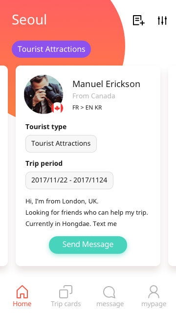
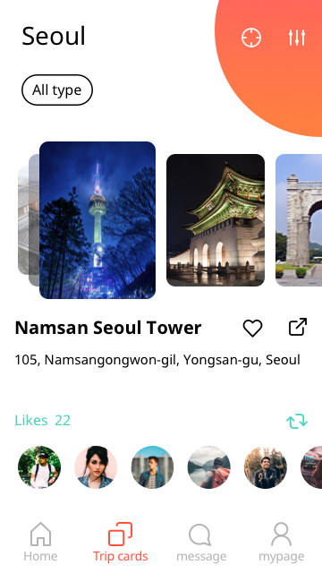
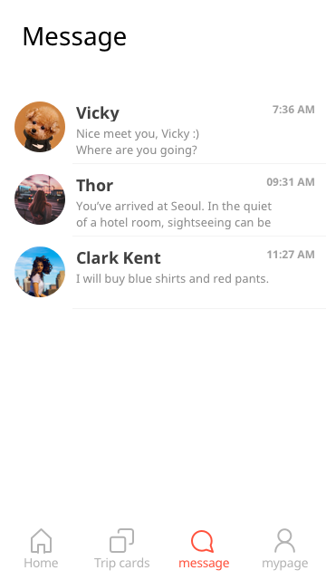
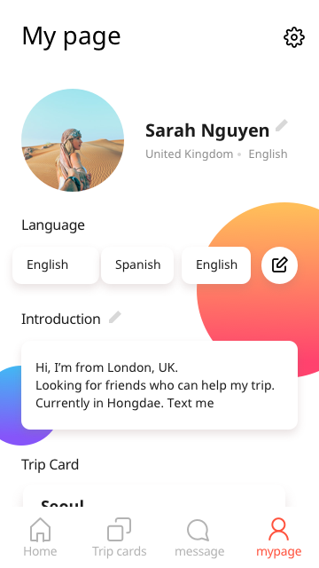

# Koing #

  
  
  
  
  

## 앱 설명 ##

우리나라에 온 관광객들에게 관광지 정보를 제공하고, 서로 매칭시켜서 도움을 주고받을 수 있는 앱
 
2017 스마트관광 앱 개발 공모전 입상
  
Play store : 
https://play.google.com/store/apps/details?id=com.tourwith.koing  
One store : 
http://www.onestore.co.kr/userpoc/apps/view?pid=0000721241

## 제작자 ##

